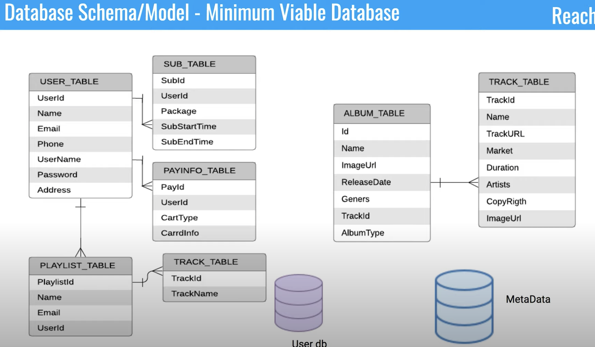
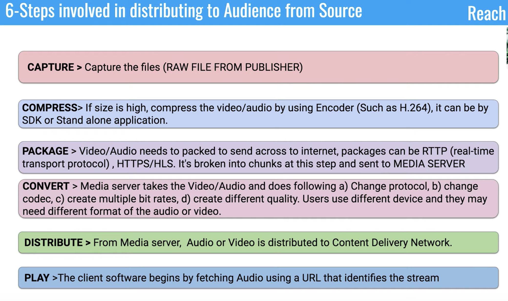
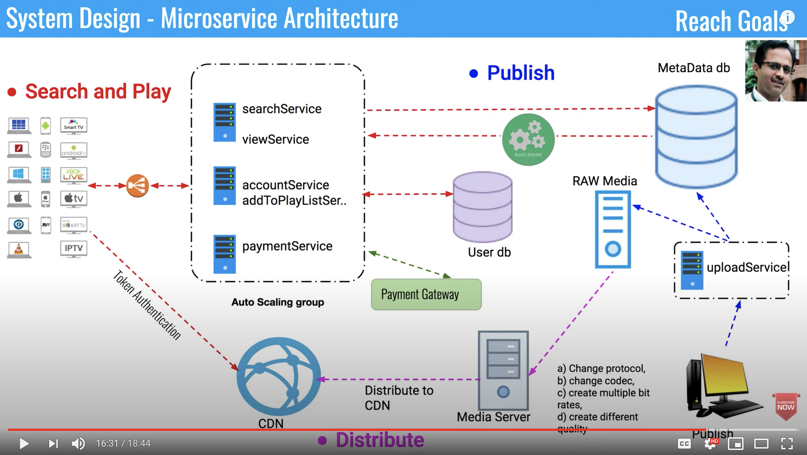

# Design Spotify
## Requirements 
- As a user i should have the ability to search for music
- As a user i should have the ability to play the music.
- As a user i should have the ability to add the music to my play list
- As a publisher should have the ability to publish the music to the service.
- As a user should have the ability to have subscription to listed to music on a continuous 
basis.

## Capacity estimation

## API's
- uploadService(app_key, albumType, artists, market, labels, name, releaseDate, tracks, restrictions, url);
- searchService(app_key, market, albumTitle, trackTitle);
- addToPlaylistService(app_key, playlistId, trackId);
- viewService(app_key, songId); //play_music
- paymentService(app_key, cardInfo);

## Data Modelling

## Implementation of distribution network

## Overall architecture

