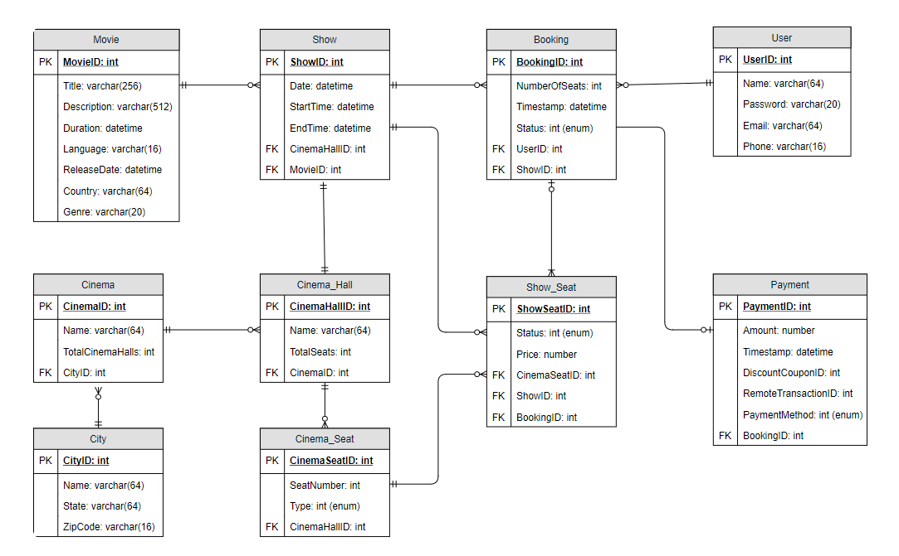
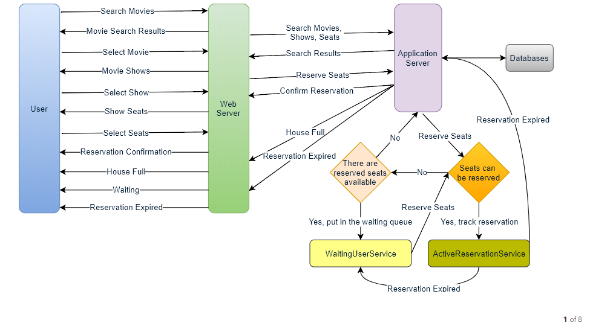

# Design Ticketmaster
 An online ticketing system that sells movie tickets.
 Note: This is almost taken from groking the system design book. There are some
 changes in wordings and to make it a little more concise. 
 
## Functional Requirements
* Our ticket booking service should be able to list down different cities where its affiliate cinemas are located.
* Once the user selects the city, the service should display the movies released in that particular city.
* Once the user selects a movie, the service should display the cinemas running that movie and its available shows.
* The user should be able to choose a show at a particular cinema and book their tickets.
* The service should be able to show the user the seating arrangement of the cinema hall. The user should be able to select multiple seats according to their preference.
* The user should be able to distinguish available seats from the booked ones.
* Users should be able to put a hold on the seats for five minutes before they make a payment to finalize the booking.
* The user should be able to wait if there is a chance that the seats might become available – e.g., when holds by other users expire.
* Waiting customers should be serviced in a fair first come first serve manner.

## Non Functional requirements
* The system would need to be highly concurrent. There will be multiple booking requests for the same seat at any particular point in time.
 The service should handle this gracefully and fairly.
* Since it's all about booking a ticket the core functionality associated with this would be transactions, so we would 
need to comply or have database with ACID properties.
* We assume we have a robust authentication and authorization library for this application (out of scope).
* The system should be scalable to handle huge surge in traffic for popular movies.
* System should be fair and not be exposed to abuse thus limit user's to having the ability to only book 10 tickets.


## Capacity Estimation

### Traffic estimation
Let’s assume that our service has 3 billion page views per month and sells 10 million tickets a month.

### Storage estimation
1. Total cities - 500
2. Cinemas in each city - 10
3. Seats in each cinema - 2000
4. Number of shows per cinema - 2

---
Things required to store would be 
- CinemaId (tells you which cinema house e.g: AMC tempe, Cinemark Bellevue etc.)
- NumberOfSeats
- ShowId (tells you the show associated to a particular date and time for a particular cinema for a particular movie)
- MovieId (the movie e.g: avengers, shawshank redemption)
- SeatNumber
- SeatStatus
- Timestamp
Let's assume that all this takes about 50 bytes to store. 

Also, lets assume that it takes 50 bytes to store movies and cinema information in the catalog
which again could be 50 bytes.


`500 * 10 * 2000 * 2 * (50+50) = 2 GB/day.`

Let's plan for 10 years that is 2GB * 365 * 10 = `~7.3 TB`

## API specifications
As a customer you will need mostly 2 api call's.
We are assuming that our API's are REST.

### Search for movies
```text
searchMovies(api_dev_key, keyword, city, lat_long, radius, start_datetime, end_datetime, postal_code, 
             includeSpellcheck, results_per_page, sorting_order)

parameters are self explanatory.

return JSON blob of movies and shows

```
Just remember what you see in the UI. 
    - City, Location (lat_long), When you plan to go to the movies, pincode.
Everything else is superfluous and not required esp w.r.t the design. 

### Reserve seats
```text
reserveSeats(api_dev_key, session_id, movie_id, show_id, seats_to_reserve[])

parameters are self explanatory.

returns status of reservation :

1) Reservation Successful
2) Reservation Failed - Show Full
3) Reservation Failed - Retry if users are holding reserved seats.
```


## Database Design
- Each City can have multiple Cinemas.
- Each Cinema will have multiple halls.
- Each Movie will have many Shows, and each Show will have multiple Bookings.
- A user can have multiple bookings. 


***Fig:Database Design.***

## Component design
At a high-level, our web servers will manage users’ sessions, and application servers will handle all the ticket management, storing data in the databases, as well as, work with the cache servers to process reservations.

### Workflow of the system
- User searches for a movie.
- The user selects a movie.
- The user is shown the available shows of the movie.
- The user selects a show.
- The user selects the number of seats to be reserved.
- If the required number of seats are available, the user is shown a map of the theater to select seats. If not, the user is taken to ‘step 8’ below.
- Once the user selects the seat, the system will try to reserve those selected seats.
- If seats can’t be reserved, we have the following options:
    1. Show is full; the user is shown the error message.
    2. The seats user wants to reserve are no longer available, but there are other seats available, so the user is taken back to the theater map to choose different seats.
    3. There are no seats available to reserve, but all the seats are not booked yet as there are some seats that other users are holding in reservation pool and have not booked yet. The user will be taken to a waiting page where they can wait until required seats get freed from the reservation pool. This waiting could result in following options:
        - If the required number of seats become available, the user is taken to the theater map page where they can choose the seats.
        - While waiting if all seats get booked, or there are fewer seats in the reservation pool than the user intend to book, the user is shown the error message.
        - User cancels the waiting and is taken back to the movie search page.
        - At maximum, a user can wait one hour, after that user’s session gets expired and the user is taken back to the movie search page.
- If seats are reserved successfully, the user has five minutes to pay for the reservation. After payment, booking is marked complete. If the user is not able to pay within five minutes, all their reserved seats are freed to become available to other users.



***Fig:Component and Workflow design.***

#### How would the server keep track of all the active reservation that haven’t been booked yet? And how would the server keep track of all the waiting customers?
We need two daemon services, one to keep track of all active reservations and to remove any expired reservation from the system, let’s call it ActiveReservationService.
The other service would be keeping track of all the waiting user requests, and as soon as the required number of seats become available,
it will notify the (the longest waiting) user to choose the seats, let’s call it WaitingUserService

1. **ActiveReservationsService**
   - We need a DS that can maintain insertion ordering and can have jump between different keys
   So it would be ideal to use a `HashMap + DLL` or a `LinkedHashMap`.
   - Each of this `LinkedHashMap` will need to be associated w.r.t a particular `showId`.
   - So eventually we would want to save something like 
       ```text
         showId : LinkedHashMap<BookingId, Timestamp>
         key    : value
         123 : { (1,14928883837), (2,14928883888), (3,14928897837) }
        ```
        earliest user will be the head of the `LinkedHashMap`.
   - Each `BookingId` will have an associated `BookingStatus` that will preserved in the dB. 
        1. Reserved - Indicates that the user has selected the seats but not yet completed the transaction.
        2. Booked - Indicates user has completed and paid for the seats. remove the `BookingId` from memory.
        3. Expired - Indicated user didn't complete the transaction even though he reserved the tickets. Remove `BookingId` from memory.
2. **WaitingUsersService**
    - The DS will be similar to that of **ActiveReservationsService** but instead of using `BookingId` here we
    need to keep a track of users so 
        ```text
                 showId : LinkedHashMap<userId, Timestamp>
                 key    : value
                 123 : { (akshayId,14928883837), (amitId,14928883888), (johnId,14928897837) }
         ```
    - So, we will keep a track of users based on FCFS in the `LinkedHashMap`.
    - Thus whenever, a `BookingStatus` goes to `Expired` state the corresponding seats would be made available to
    users in the **WaitingUsersService** based on FCFS. We can limit the maximum capacity of users that can be in the
    **WaitingUsersService** for not over flooding the DS with infinite users.
    - The service can use [LongPolling](https://en.wikipedia.org/wiki/Push_technology#Long_polling) to constantly
    check the status of reservation.
    
## Concurrency
#### How to handle concurrency; such that no two users are able to book same seat?
We can use transactions in SQL databases to avoid any clashes. For example, if we are using SQL server we can utilize Transaction Isolation Levels 18 to lock the rows before we can update them. Here is the sample code:

```sql
SET TRANSACTION ISOLATION LEVEL SERIALIZABLE;

BEGIN TRANSACTION;

    -- Suppose we intend to reserve three seats (IDs: 54, 55, 56) for ShowID=99 
    Select * From Show_Seat where ShowID=99 && ShowSeatID in (54, 55, 56) && Status=0 -- free 

    -- if the number of rows returned by the above statement is three, we can update to 
    -- return success otherwise return failure to the user.
    update Show_Seat ...
    update Booking ...

COMMIT TRANSACTION;
```
`Serializable` is the highest isolation level and guarantees safety from [Dirty](https://en.wikipedia.org/wiki/Isolation_(database_systems)#Dirty_reads),
 [Nonrepeatable](https://en.wikipedia.org/wiki/Isolation_(database_systems)#Non-repeatable_reads) and [Phantoms](https://en.wikipedia.org/wiki/Isolation_(database_systems)#Phantom_reads) reads. One thing to note here, within a transaction if we read rows we get a write lock on them so that they can’t be updated by anyone else.

Once the above database transaction is successful, we can start tracking the reservation in ActiveReservationService.

## Fault Tolerance
  #### What happens when ActiveReservationsService or WaitingUsersService crashes?
  - *Option 1* : Use Master slave architecture so that slave takes over as soon as master crashes.
  - *Option 2* : ead all the active reservations from the `Booking` table. Remember that we keep the `Status` column as `Reserved` until a reservation gets booked

## Database Partitioning
   - For partition we need to identify a key such that it won't effect load based on factors
   like traffic surge. meaning at all times we would want our partition to be effective in 
   distributing the load.
   - So, in this case if we use `MovieId` for popular movies we may overload a particular server.
   A better solution to be to use `ShowId` to distribute it equally.
   - We can use [Consistent Hashing](https://medium.com/system-design-blog/consistent-hashing-b9134c8a9062) for both the
   **ActiveReservationsService** and **WaitingUsersService** based on `ShowId`.
   - Let’s assume for load balancing our Consistent Hashing 10allocates three servers for any Show, so whenever a reservation is expired, the server holding that reservation will do following things:
       1. Update database to remove the Booking (or mark it expired) and update the seats’ Status in ‘Show_Seats’ table.
       2. Remove the reservation from the Linked HashMap.
       3. Notify the user that their reservation has expired.
       4. Broadcast a message to all WaitingUserService servers that are holding waiting users of that Show to figure out the longest waiting user. Consistent Hashing scheme will tell what servers are holding these users.
       5. Send a message to the WaitingUserService server holding the longest waiting user to process their request if required seats have become available.
   - Whenever a reservation is successful, following things will happen:
       1. The server holding that reservation sends a message to all servers holding waiting users of that Show so that they can expire all those waiting users that need more seats than the available seats.
       2. Upon receiving the above message, all servers holding the waiting users will query the database to find how many free seats are available now. Database cache would greatly help here to run this query only once.
       3. Expire all waiting users who want to reserve more seats than the available seats. For this, WaitingUserService has to iterate through the Linked HashMap of all the waiting users.
   


